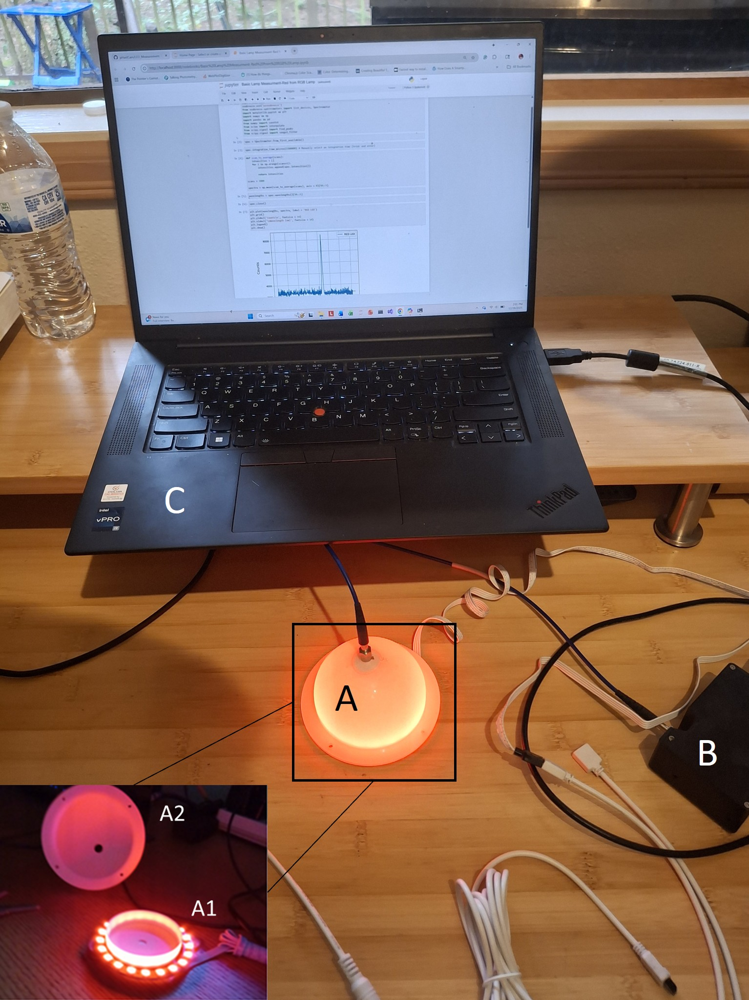
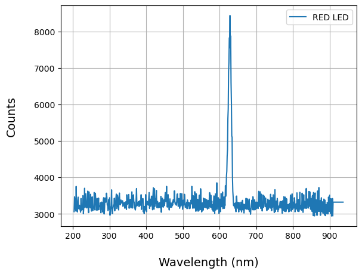

|  | This figure shows the LED measurement set-up.  The feature labeled 'A' is the ring LED enclosed in a lab-made low-cost semi-integrating sphere.  The assembly is shown in the lower left corner.  A1 shows the ring LED baffled with a plastic petri dish coated with diffuse white paint.  A2 is the semi-sphere also coated with diffuse white paint.  The top of the semi-sphere is connected to a fiber optic cable that collects light for measurement by the USB2000 spectroradiometer (B).  A cable connecting the spectroradiometer to the laptop computer (C) (via a USB port) provides power to the spectroradiometer. It serves as a conduit for instructions and data between the Python script hosted on the laptop and the USB2000. |
|---------------------------------------------|:----------------------------------------------|

**The Python script establishes communications with the spectroradiometer - for more info on this, check out [this python-seabreeze repo](https://github.com/ap--/python-seabreeze) and [this frugal spectroscopy repo](https://github.com/timrobinson/Frugal-Spectroscopy). Next, within the script, you establish the integration time in microseconds. Then you run multiple scans and signal-average these scans.  This leads to a spectrum as shown below.  The last cells interpolate the data so that a two-column array is saved to file, with a wavelength range of 400 to 700 nm in 5 nm increments.  It also normalizes the counts.  This interpolation is performed so that the LED data can be readily multiplied by other components of a model (such as dye spectra and camera responsivity)**

  

## Repository Guide

### 🔧 Installation Guide

Follow these steps to set up the environment and run the code:

1. **Create a working folder** on your local machine and move into it:

> mkdir Projects

> cd Projects

2. **Obtain the repository**

> git clone https://github.com/pHastCam/Dye-Indicator-Model.git

> cd Dye-Indicator-Model

3. **Create the conda environment**

> conda env create -f environment.yml

4. **Activate the environment**
